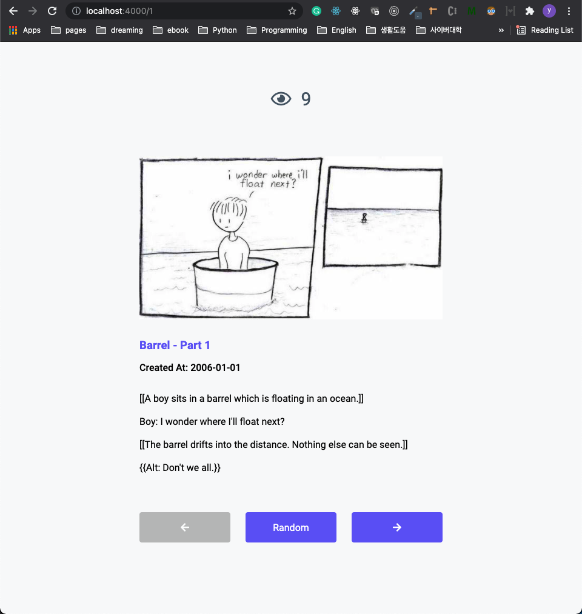
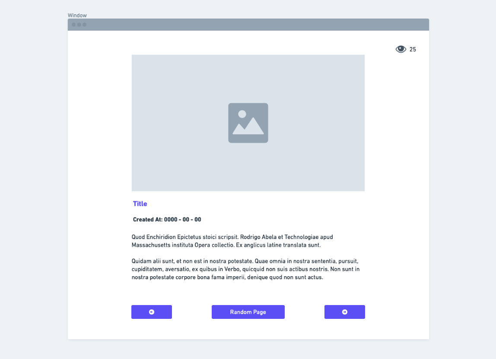

# Cyber City Comics Demo

This is a demo project for Stratus360's full stack developer position. I tried to implement it without using any modern web framework. As I was not sure if I could use those fancy tools while working on this task. I mainly used only vanilla javascript and html. I used express.js framework only for routing for deployment and for view counter.

The code might looks a little bit massy and long because I only used vanilla js ways. If you want, I can make all codes simpler and cleaner using modern web frameworks like React.js

Thank you :)

## Table of contents

- [Demo](#demo)
- [Documentation](#documentation)

## Demo

<https://jjung-cyber-city-comis.herokuapp.com>  

## Documentation

### Tach Stack

#### Front

- HTML
- CSS
- JavaScript

#### Back

- Express.js

#### Database

- MongoDB

### Functionality (requirements)

- Pagination (Previous, Next, Random)
- Page View Count
- Responsive Design

### Initial Design (Whimsical)

